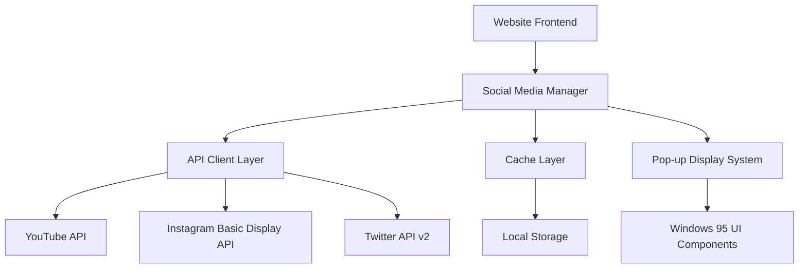

# Social Media Integration Design Document

## Overview

The social media integration system will fetch real-time posts from YouTube, Instagram, and Twitter APIs and display them as Windows 95-style pop-up advertisements on the Alien Labs website. The system uses a modular architecture with API clients, caching layer, and a responsive UI component that maintains the retro aesthetic while providing modern functionality.

## Architecture

### High-Level Architecture



### Data Flow

1. **Initialization**: Social Media Manager loads cached posts and validates API credentials
2. **Fetching**: API clients retrieve fresh content from each platform every 15 minutes
3. **Processing**: Raw API responses are normalized into a common post format
4. **Caching**: Processed posts are stored in local storage with timestamps
5. **Display**: Pop-up system rotates through available posts with platform-specific styling

## Components and Interfaces

### Core Components

#### 1. SocialMediaManager
```typescript
interface SocialMediaManager {
  fetchAllPosts(): Promise<SocialPost[]>
  getCachedPosts(): SocialPost[]
  refreshPosts(): Promise<void>
  validateCredentials(): boolean
}
```

#### 2. Platform API Clients
```typescript
interface APIClient {
  fetchPosts(limit: number): Promise<RawPost[]>
  isAuthenticated(): boolean
  getRateLimit(): RateLimitInfo
}

// Specific implementations:
// - YouTubeAPIClient
// - InstagramAPIClient  
// - TwitterAPIClient
```

#### 3. Enhanced Pop-up Component
```typescript
interface SocialPopupAds {
  posts: SocialPost[]
  onPostClick: (post: SocialPost) => void
  displayInterval: number
  autoCloseDelay: number
}
```

### API Integration Details

#### YouTube Data API v3
- **Endpoint**: `GET /youtube/v3/search` and `/youtube/v3/videos`
- **Authentication**: API Key
- **Rate Limit**: 10,000 units/day
- **Data Retrieved**: Video title, thumbnail, view count, publish date, video ID

#### Instagram Basic Display API
- **Endpoint**: `GET /me/media`
- **Authentication**: OAuth 2.0 Access Token
- **Rate Limit**: 200 requests/hour per user
- **Data Retrieved**: Image URL, caption, timestamp, permalink, media type

#### Twitter API v2
- **Endpoint**: `GET /2/users/:id/tweets`
- **Authentication**: Bearer Token (OAuth 2.0)
- **Rate Limit**: 300 requests/15-minute window
- **Data Retrieved**: Tweet text, public metrics, created_at, tweet ID

## Data Models

### Unified Social Post Model
```typescript
interface SocialPost {
  id: string
  platform: 'youtube' | 'instagram' | 'twitter'
  content: {
    text?: string
    title?: string
    imageUrl?: string
    thumbnailUrl?: string
  }
  author: {
    username: string
    displayName: string
    avatarUrl?: string
  }
  engagement: {
    likes?: number
    views?: number
    comments?: number
    shares?: number
  }
  timestamp: string
  url: string
  createdAt: Date
}
```

### API Response Models
```typescript
// YouTube Video Response
interface YouTubeVideo {
  id: string
  snippet: {
    title: string
    description: string
    thumbnails: { medium: { url: string } }
    publishedAt: string
    channelTitle: string
  }
  statistics: {
    viewCount: string
    likeCount: string
    commentCount: string
  }
}

// Instagram Media Response
interface InstagramMedia {
  id: string
  caption: string
  media_type: 'IMAGE' | 'VIDEO' | 'CAROUSEL_ALBUM'
  media_url: string
  thumbnail_url?: string
  timestamp: string
  permalink: string
}

// Twitter Tweet Response
interface TwitterTweet {
  id: string
  text: string
  created_at: string
  public_metrics: {
    retweet_count: number
    like_count: number
    reply_count: number
    quote_count: number
  }
  author_id: string
}
```

## Error Handling

### API Error Scenarios
1. **Rate Limit Exceeded**: Implement exponential backoff with jitter
2. **Authentication Failure**: Log error, use cached content, notify admin
3. **Network Timeout**: Retry with increasing delays (1s, 2s, 4s)
4. **Invalid Response**: Validate response schema, skip malformed posts
5. **No Posts Available**: Display fallback content or hide pop-ups

### Graceful Degradation
- **Primary**: Live API data with full functionality
- **Secondary**: Cached posts from previous successful fetches
- **Tertiary**: Static sample posts as ultimate fallback
- **Failure**: Hide pop-up system entirely if all sources fail

## Testing Strategy

### Unit Tests
- API client response parsing and error handling
- Post normalization and data transformation
- Cache management and expiration logic
- Pop-up timing and display logic

### Integration Tests
- End-to-end API fetching with mock responses
- Cache persistence across browser sessions
- Pop-up display cycle with real post data
- Error recovery and fallback mechanisms

### Manual Testing
- Test with actual API credentials and live data
- Verify pop-up appearance and timing on different devices
- Test link functionality to external social platforms
- Validate Windows 95 styling consistency

## Security Considerations

### API Key Management
- Store API keys in environment variables
- Never expose credentials in client-side code
- Use server-side proxy for sensitive API calls
- Implement key rotation procedures

### Content Validation
- Sanitize all user-generated content from APIs
- Validate image URLs before displaying
- Filter inappropriate content using keyword lists
- Implement content moderation hooks

### Privacy Compliance
- Only fetch public posts and data
- Respect platform terms of service
- Implement user consent for external link tracking
- Provide opt-out mechanism for pop-up ads

## Performance Optimization

### Caching Strategy
- **L1 Cache**: In-memory posts for current session (5 minutes)
- **L2 Cache**: Local storage for persistent caching (15 minutes)
- **L3 Cache**: Server-side cache for shared data (1 hour)

### Loading Optimization
- Lazy load images in pop-ups
- Preload next post content in background
- Use intersection observer for efficient rendering
- Implement virtual scrolling for large post lists

### Bundle Size Management
- Code-split API clients by platform
- Lazy load social components on demand
- Use tree-shaking for unused API methods
- Compress and optimize image assets